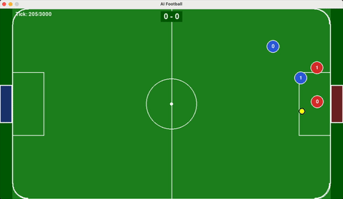

# AI Football Competition Environment

A 2D football (soccer) simulation environment for AI agent competition.



## Usage

```bash
python main.py                              # Run game with visualization
python main.py --no-viz                     # Run game without visualization
python main.py --replay LOG.json            # Replay a game log
python main.py --players 3                  # 3v3 game
python main.py --agents tactical            # Use tactical preset
python main.py --agents goalie,striker      # Specify each player's agent
```

## Command Line Options

| Option | Description | Default |
|--------|-------------|---------|
| `--replay LOG` | Replay a game log file | - |
| `--no-viz` | Run without visualization | False |
| `--players N` | Players per team | 2 |
| `--ticks N` | Max game ticks | 3000 |
| `--win-score N` | Score to win | 5 |
| `--agents TYPE` | Agent configuration (see below) | randomized |
| `--log PATH` | Path to save game log | auto |
| `--no-log` | Disable game log saving | False |
| `--scale F` | Display scale factor | 1.0 |

## Agents

Each agent type has a distinct behavior and playing style:

### RandomAgent
- **Behavior**: Takes completely random actions
- **Use case**: Baseline/testing
- **Strategy**: Moves in random directions with random acceleration magnitudes

### ChaserAgent
- **Behavior**: Directly chases the ball and kicks when close
- **Use case**: Simple but effective ball pursuit
- **Strategy**: Calculates vector to ball, moves at max acceleration toward it with slight noise, kicks when within range (40 units)

### GoalieAgent
- **Behavior**: Stays near own goal and blocks shots
- **Use case**: Defensive goalkeeper role
- **Strategy**: Positions at fixed X near goal line, tracks ball's Y position (clamped to goal area), kicks away when ball comes close

### StrikerAgent
- **Behavior**: Aggressive forward that pushes toward opponent's goal
- **Use case**: Offensive scoring role
- **Strategy**: When far from ball, chases directly. When close (<100 units), positions behind the ball relative to opponent's goal to set up shots

### DefenderAgent
- **Behavior**: Stays between ball and own goal
- **Use case**: Defensive protection role
- **Strategy**: Positions 30% of the way from ball to own goal, stays in defensive third of field (doesn't push forward past 40% line), clears ball when close

### InterceptorAgent
- **Behavior**: Predicts ball movement and intercepts
- **Use case**: Proactive ball recovery
- **Strategy**: Calculates predicted ball position 20 ticks ahead using ball velocity, moves to intercept point rather than current ball position

### MidfielderAgent
- **Behavior**: Balanced support for attack and defense
- **Use case**: All-around midfield role
- **Strategy**: Tracks ball position but stays in midfield zone (30-70% of field). Pushes forward when ball is in attacking half, falls back to center when defending

### AggressorAgent
- **Behavior**: Very aggressive ball chaser at maximum speed
- **Use case**: High-pressure play style
- **Strategy**: Direct chase with no positioning subtlety - always max acceleration toward ball, extended kick range (45 units), no noise in movement

### WingerAgent
- **Behavior**: Fast flank player that stays wide
- **Use case**: Wing attack and crossing plays
- **Strategy**: Positions on top or bottom flank (20% or 80% of field height based on player_id). Stays ahead of ball position, goes for ball when it comes within 150 units

## Tactics (Strategy Presets)

Presets configure entire teams with specific formations:

### mixed
- **Formation**: Goalie + Chasers
- **Description**: First player is goalkeeper, rest are ball chasers
- **Best for**: Simple balanced play

### tactical
- **Formation**: Goalie + Defender + Strikers
- **Description**: Classic defensive structure with forward attackers
- **Best for**: Organized play with clear roles

### aggressive
- **Formation**: All Aggressors
- **Description**: Every player aggressively chases the ball
- **Best for**: High-pressure, chaotic gameplay

### balanced
- **Formation**: Goalie + Midfielder + Strikers
- **Description**: Goalkeeper with midfield support and forwards
- **Best for**: Flexible attack/defense transitions

### wings
- **Formation**: Goalie + Wingers
- **Description**: Goalkeeper with wide flank players
- **Best for**: Spread-out attacking play

### diverse
- **Formation**: One of each agent type (cycled)
- **Description**: Goalie, Defender, Striker, Midfielder, Interceptor, Aggressor, Winger assigned in order
- **Best for**: Testing different agent behaviors together

### randomized
- **Formation**: Random assignment
- **Description**: Each player randomly assigned any agent type
- **Best for**: Unpredictable, varied gameplay

## Custom Agent Configuration

You can specify exact agents for each player using comma-separated values:

```bash
# 2v2 game with specific agents for each of 4 players
python main.py --players 2 --agents goalie,striker,goalie,defender

# First 2 agents = Team 0, Next 2 agents = Team 1
# Team 0: goalie (player 0), striker (player 1)
# Team 1: goalie (player 0), defender (player 1)

# Partial specification (remaining players get default 'chaser')
python main.py --players 3 --agents goalie,striker
# Team 0: goalie, striker, chaser
# Team 1: chaser, chaser, chaser
```

## Agent Type Reference

| Type | Class | Key Behavior |
|------|-------|--------------|
| `random` | RandomAgent | Random movement |
| `chaser` | ChaserAgent | Direct ball pursuit |
| `goalie` | GoalieAgent | Goal protection |
| `striker` | StrikerAgent | Offensive positioning |
| `defender` | DefenderAgent | Defensive positioning |
| `interceptor` | InterceptorAgent | Ball prediction |
| `midfielder` | MidfielderAgent | Zone-based support |
| `aggressor` | AggressorAgent | Maximum aggression |
| `winger` | WingerAgent | Flank positioning |
